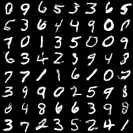

# DCGAN in Tensorflow 2.13.0rc1

Tensorflow implementation of [Deep Convolutional Generative Adversarial Networks](http://arxiv.org/abs/1511.06434) which is a stabilize Generative Adversarial Networks. The referenced torch code can be found [here](https://github.com/soumith/dcgan.torch).

* [Brandon Amos](http://bamos.github.io/) wrote an excellent [blog post](http://bamos.github.io/2016/08/09/deep-completion/) and [image completion code](https://github.com/bamos/dcgan-completion.tensorflow) based on [this repo old repo](https://github.com/carpedm20/DCGAN-tensorflow).
* *To avoid the fast convergence of D (discriminator) network, G (generator) network is updated twice for each D network update, which differs from original paper.*

## Online Demo from old repo owner

[website link](http://carpedm20.github.io/faces/)

## Prerequisites

* Python 3.10.6
* Tensorflow 2.13.0rc1
* [SciPy](http://www.scipy.org/install.html)
* [pillow](https://github.com/python-pillow/Pillow)
* [tqdm](https://pypi.org/project/tqdm/)
* (Optional) [moviepy](https://github.com/Zulko/moviepy) (for visualization)
<!-- - (Optional) [Align&Cropped Images.zip](http://mmlab.ie.cuhk.edu.hk/projects/CelebA.html) : Large-scale CelebFaces Dataset -->

## Repo Guide

<!-- First, download dataset with:

    $ python download.py mnist celebA -->

### Data

Download your dataset and put it in directory. The should be identical in channel. Either *RGB* (3 channels) or *Gray-scale* (1 channel). Image dimensions must be at least **32x32**. If your images dimension is higher than 32, but has arbitrary/random dimensions, you need to make sure that they are multiple of 32. To do this, you can pass `--crop True` while training; and set the `--output-height multiple-of-32-e.g. 32, 64, 96, 128`.

You can use 4 built-in dataset for experiments, without manually downloading and putting them in directory, then passing the directory path.

1. `mnist`
2. `fashion_mnist`
3. `cifar10`
4. `cifar100`

For custom dataset, put your data into the directory named after your data e.g. `--dataset celebA` and make sure this directory is present under the `--data-dir` argument. e.g. Expected structure of data could be following if you passed `--data-dir ./data` and `--dataset celebA`; then `./data/celebA/*.jpg`. Also don't forget to include `--input-fname-pattern` argument. This is the image type (extension) of images under `./data/celebA/`.

For built-in dataset, you can just only pass the name of dataset. (out of above listed 4 dataset) `--dataset cifar100`.

### Training

For saving best models, checkpoints, output samples during training and loss graphs, you need to setup an directory for it. You can pass `--out-dir` as a parent of all of this data. Structure would be as below:

1. `--out-dir` e.g. `./out` - code will create a nested directory named after `--dataset`+`current-date` in it. So, we will have a separate out directory for all different dataset. e.g. `./out/mnist_2023-06-13` -> `--out-dir/--dataset_current_date`.
2. `--sample-dir` e.g. `samples` - code will create a `samples_str(time.strftime('%Y-%m-%d %H:%M:%S'))` directory inside `out` directory as ``./out/mnist_2023-06-13/samples_str(time.strftime('%Y-%m-%d %H:%M:%S'))` to identify different samples generated in a single day.
3. `--checkpoint-dir`  e.g. `checkpoints` - directory under `--out-dir/--dataset_current_date` to store model during training.
4. `--checkpoint-prefix` e.g. `checkpoint` starting name prefix to save models in `--checkpoint-dir`.
5. `ckpt-frq` e.g. `10` save checkpoints every this much `epochs` - `best_model` will automatically be saving
6. `--max-to-keep` e.g. `5` to set the maximum number of checkpoints to save - remove older ones
7. `--sample-freq` e.g. `100` wait of this much iteration (batch counts) to get sample from model during training

### Experimental settings

1. `--z-dim` e.g. `100` - noise length to seed generator for image generation
2. `--generate-test-image` e.g. `100` - Images to generate during testing
3. `--visualize` e.g. `True` to make a gif of generated images
4. `--load-best-model-only` e.g. `True` - if True, during testing, load best model from `--checkpoint-dir/best_model*` other wise load latest model from `--checkpoint-dir/checkpoint*`.
5. `--train` e.g. `True` - True for training, False for testing
6. `--early-stop-count` e.g. `20` - number of epoch to wait to quit training if model is not improving learning
7. `--batch-size` e.g. `64`
8. `--learning-rate` e.g. `0.001`
9. `--beta1` e.g. `0.5` momentum term for `Adam`

## Usage

To train a model with built-in datasets:

    $ python main.py --dataset mnist --train
    $ python main.py --dataset cifar100 --train --z-dim 100 --early-stop-count 30 --batch-size 64 --learning-rate 0.001 --beta1 0.5

To train a model with custom self-downloaded datasets:

    $ python main.py --dataset celebA --data-dir /home/master/data --input_fname_pattern= "*_cropped.png" --train
    $ python main.py --dataset celebA --data-dir /home/user-name/data --out-dir /home/user-name/Documents --sample-dir results-during-training --checkpoint-dir saved-models --checkpoint-prefix checkpoint  --train

To test with an existing model:

    $ python main.py --dataset mnist --load-best-model-only --visualize
    $ python main.py --dataset celebA --crop --generate-test-images 1000

## Results

### celebA

After 6th epoch:

After 10th epoch:

### Asian face dataset

### MNIST

More results can be found [here](./assets/) and [here](./web/img/).

## Training details

Details of the loss of Discriminator and Generator (with custom dataset not celebA).

Details of the histogram of true and fake result of discriminator (with custom dataset not celebA).

## Related works

* [BEGAN-tensorflow](https://github.com/carpedm20/BEGAN-tensorflow)
* [DiscoGAN-pytorch](https://github.com/carpedm20/DiscoGAN-pytorch)
* [simulated-unsupervised-tensorflow](https://github.com/carpedm20/simulated-unsupervised-tensorflow)

## Author

MasterHM / [@MasterHM-ml](https://github.com/MasterHM-ml/)
