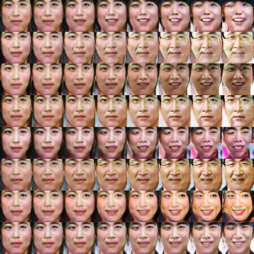

# DCGAN in Tensorflow 2.13.0rc1

Tensorflow implementation of [Deep Convolutional Generative Adversarial Networks](http://arxiv.org/abs/1511.06434) which is a stabilize Generative Adversarial Networks. The referenced torch code can be found [here](https://github.com/soumith/dcgan.torch).


* [Brandon Amos](http://bamos.github.io/) wrote an excellent [blog post](http://bamos.github.io/2016/08/09/deep-completion/) and [image completion code](https://github.com/bamos/dcgan-completion.tensorflow) based on [this repo old repo](https://github.com/carpedm20/DCGAN-tensorflow).
* *To avoid the fast convergence of D (discriminator) network, G (generator) network is updated twice for each D network update, which differs from original paper.*

## Online Demo from old repo owner

[](http://carpedm20.github.io/faces/)

[website link](http://carpedm20.github.io/faces/)

## Prerequisites

* Python 3.10.6
* Tensorflow 2.13.0rc1
* [SciPy](http://www.scipy.org/install.html)
* [pillow](https://github.com/python-pillow/Pillow)
* [tqdm](https://pypi.org/project/tqdm/)
* (Optional) [moviepy](https://github.com/Zulko/moviepy) (for visualization)
<!-- - (Optional) [Align&Cropped Images.zip](http://mmlab.ie.cuhk.edu.hk/projects/CelebA.html) : Large-scale CelebFaces Dataset -->

### Data

Download your dataset and put it in directory. The data should be identical in channel - *RGB* (3 channels). Image dimensions must be at least **32x32**. If your images dimension is higher than 32, but has arbitrary/random dimensions, you need to make sure that they are multiple of 32. To do this, you can pass `--crop True` while training; and set the `--output-height multiple-of-32-e.g. 32, 64, 96, 128` - make sure passed `output-height` is less than passed `input-height`.

For custom dataset, put your data into the directory named after your data e.g. `--dataset landscape-data` and make sure this directory is present under the `--data-dir` argument. e.g. Expected structure of data could be following if you passed `--data-dir ./data` and `--dataset celebA`; then `./data/celebA/*.jpg`. Also don't forget to include `--input-fname-pattern` argument. This is the image type (extension) of images under `./data/celebA/`.

### Training

For saving best models, checkpoints, output samples during training and loss graphs, you need to setup an directory for it. You can pass `--out-dir` as a parent of all of this data. Structure would be as below:

1. `--out-dir` e.g. `./output` - code will create a nested directory named after `--dataset/current-date-time` in it. So, we will have a separate out directory for all different dataset. e.g. `./output/landscape-data/2023-06-13 06:10:11` -> `--out-dir/--dataset/current_date_time`.
2. `--sample-dir` e.g. `samples` - code will create a directory named after `--sample-dir` inside `--out-dir`. This will further have some fixed nested directories e.g. 
   1. `output/landscape-pictures/2023-07-05 16:15:56/samples/losses` save loss graph and csv
   2. `output/landscape-pictures/2023-07-05 16:15:56/samples/media/collage` save collage during training at each epoch
   3. `output/landscape-pictures/2023-07-05 16:15:56/samples/media/epoch` save 3 individual images at every epoch
3. `--checkpoint-dir`  e.g. `checkpoints` - directory under `--out-dir/--dataset/current_date_time/` to store model during training.
4. `--checkpoint-prefix` e.g. `checkpoint` starting name prefix to save models in `--checkpoint-dir`.
5. `--sample-freq` e.g. `100` wait of this much iteration (batch counts) to get sample from model during training

### Experimental settings

1. `--z-dim` e.g. `100` - noise length to seed generator for image generation
2. `--generate-test-image` e.g. `100` - Images to generate during testing
3. `--visualize` e.g. `True` to make a gif of generated images - works only for RGB images
4. `--load-best-model-only` e.g. `True` - if True, during testing, load best model from `--checkpoint-dir/best_model*` other wise load latest model from `--checkpoint-dir/checkpoint*`.
5. `--train` e.g. `True` - True for training, False for testing
6. `--retrain` e.g. `True` if retraining from some previously trained checkpoints, else False
7. `--load-model-dir` e.g `output/landscape-pictures/2023-07-05 16:15:56/` if `--retrain` is True
8. `--load-model-prefix` e.g. `checkpoint` - model name prefix under `--load-model-dir`
9. `--batch-size` e.g. `4`
10. `--g-learning-rate` e.g. `0.001`
11. `--d-learning-rate` e.g. `0.001`
12. `--beta1` e.g. `0.5` momentum term for `Adam`

## Usage

To train a model with custom self-downloaded datasets:

```sh
!python3 main.py --train True --dataset "landscape-data" --data-dir "data" --crop True --output-height 256 --output-width 256\
--input-width 256 --input-height 256\
--c-dim 3 --batch-size 4 --epoch 50  --logging-frequency 500 \
--g-learning-rate 0.0005 --d-learning-rate 0.0005
```

To retrain a model that is trained previously as well

```sh
!python3 main.py --retrain True --dataset "$dataset_name" --data-dir "$path_to_dataset"  --crop True \
--output-height 256 --output-width 256 --input-width 256 --input-height 256\
--c-dim 3 --batch-size 4 --epoch 50  --logging-frequency 500 \
--g-learning-rate 0.00005 --d-learning-rate 0.00005 --load-model-prefix checkpoint
--load-model-dir "output/landscape-pictures/2023-07-05 16:15:56/"
```

To test with an existing model:

```sh
!python3 main.py --dataset "landscape-data" --data-dir "data" --crop True \
--output-height 256 --output-width 256 --input-width 256 --input-height 256\
--c-dim 3 --batch-size 4 --epoch 200  --logging-frequency 500 \
--g-learning-rate 0.001 --d-learning-rate 0.001 
--checkpoint-dir "output/landscape-pictures/2023-07-05 17:49:03/"

```

## Results


### celebA

After 6th epoch:


After 10th epoch:


### Asian face dataset





### MNIST


More results can be found [here](./assets/) and [here](./web/img/).

## Training details

Details of the loss of Discriminator and Generator (with custom dataset not celebA).


Details of the histogram of true and fake result of discriminator (with custom dataset not celebA).


## Related works

* [BEGAN-tensorflow](https://github.com/carpedm20/BEGAN-tensorflow)
* [DiscoGAN-pytorch](https://github.com/carpedm20/DiscoGAN-pytorch)
* [simulated-unsupervised-tensorflow](https://github.com/carpedm20/simulated-unsupervised-tensorflow)

## Author

MasterHM / [@MasterHM-ml](https://github.com/MasterHM-ml/)
